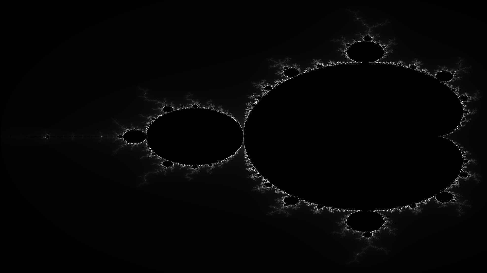

# Summary
A simple library for getting raw pixel data for a given portion or the complex plane.

Right now only grayscale is supported, but supprot for color profiles is planned.

Can create: 
- <a src="https://docs.rs/image/latest/image/type.RgbImage.html">`image::color::RgbImage`</a>
- <a src="https://docs.rs/epaint/latest/epaint/image/struct.ColorImage.html">`epaint::image::ColorImage`</a>

# Quickstart Usage
use <b>`cargo test terminal`</b> to specify the image resolution, complex plane origin, viewport scale, and iteration cut off

# Example

